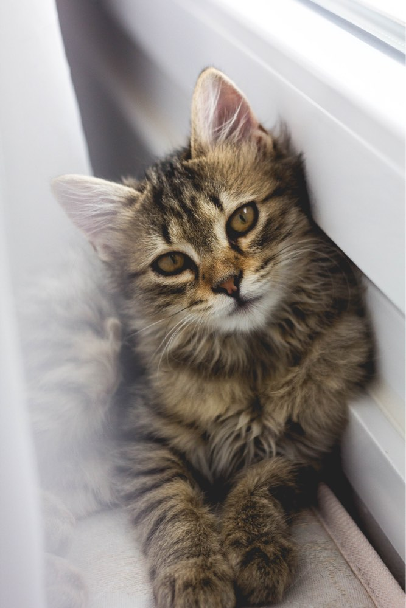

[[toc]]

this is edit from github

[code](/code/)

# This is an example doc for handbook test

## Vue press

Hi hi

| Tables        |      Are      |   Cool |
| ------------- | :-----------: | -----: |
| col 3 is      | right-aligned | \$1600 |
| col 2 is      |   centered    |   \$12 |
| zebra stripes |   are neat    |    \$1 |

